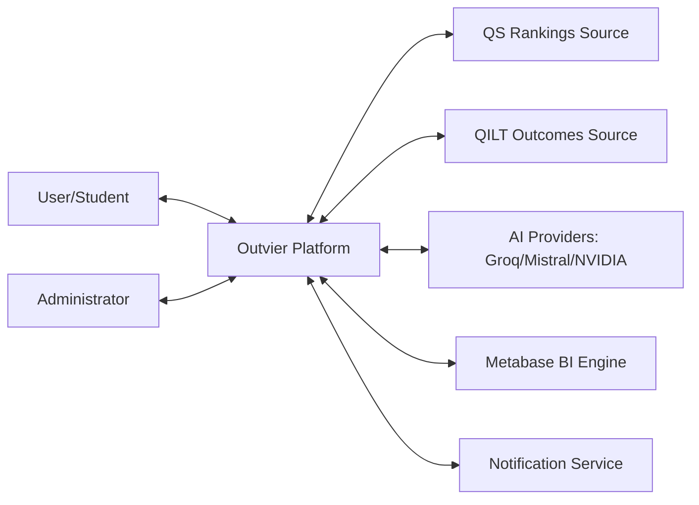
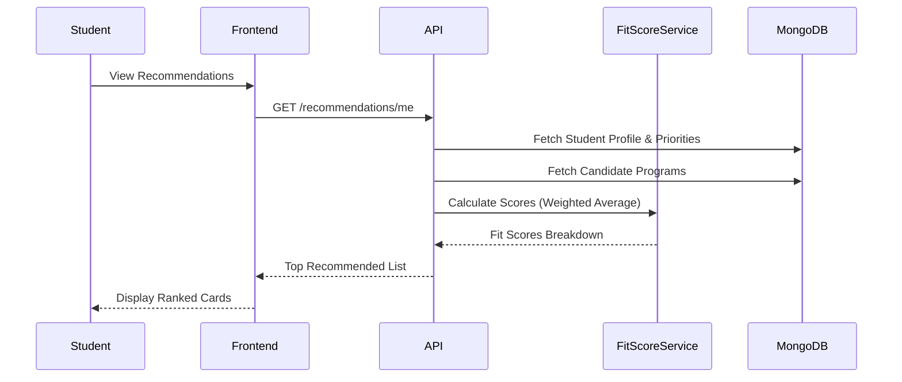
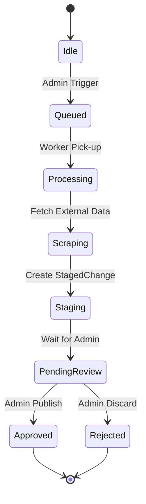

# Outvier — Specification and Design Document

## 1. Executive Summary
**Outvier** is a comprehensive full-stack decision-support platform designed to assist prospective students in selecting Australian universities. By aggregating multi-dimensional data—including global rankings, graduate outcomes, tuition fees, and scholarships—Outvier provides a data-driven approach to educational planning. The platform features a personalized "Fit Score" engine, a Kanban-style application tracker, and an AI-powered copilot to guide users through their decision-making journey. For administrators, Outvier provides automated data-sync pipelines and business intelligence through Metabase integration.

---

## 2. Specification

### 2.1 System Description
Outvier bridges the information gap between university marketing and student needs. It serves two primary user groups:
- **Students**: Seeking a personalized interface to compare programs, institutions, and living costs.
- **Administrators**: Data managers who oversee automated scraping, review data updates, and monitor platform performance.

The platform is architected as a high-performance monorepo with a decoupled frontend, backend, and background processing layer.

### 2.2 Feasibility Analysis

#### 2.2.1 Technical Feasibility
The project utilizes a modern, production-grade stack:
- **Frontend**: Next.js 16 (App Router), Vanilla CSS, Radix UI, TanStack Query.
- **Backend**: Node.js/Express (TypeScript), JWT/RBAC.
- **Infrastructure**: BullMQ and Redis for managing long-running background jobs.
- **Analytics**: Metabase (Self-hosted via Docker).
This stack ensures rapid development, high performance, and robust data handling.

#### 2.2.2 Economic Feasibility
By leveraging open-source components and containerized services (MongoDB, Redis, Metabase), Outvier minimizes infrastructure costs. The system is designed to run efficiently on standard cloud VPS instances, reducing total cost of ownership.

#### 2.2.3 Organizational Feasibility
Outvier streamlines the research process for students and provides educational consultants with a structured tool for institutional comparison, fitting naturally into the recruitment and admissions ecosystem.

### 2.3 Requirements Specification

#### 2.3.1 Functional Requirements
- **Student Profile**: Capture academic preferences and priority weights (Affordability, Ranking, etc.).
- **Fit Score Engine**: Algorithmic scoring of universities/programs based on profile match.
- **Comparison Tool**: Multi-entity (Program or University) side-by-side comparison (max 4).
- **Application Tracker**: Kanban board for managing "Researching" to "Enrolled" states.
- **Budget Calculator**: State-specific living cost estimations.
- **AI Copilot**: Context-aware chat assistant for personalized advice.
- **Admin Dashboard**: Bulk data management, sync job triggers, and staged change review.

#### 2.3.2 Non-functional Requirements
- **Performance**: Optimized MongoDB indexing for fast search and filtering.
- **Scalability**: Queue-based worker system to prevent API bottlenecks during heavy data syncs.
- **Security**: AES-256 encryption for external AI keys and JWT for session management.
- **User Experience**: Premium visual design with micro-animations and responsive layouts.

### 2.4 Use Cases

#### 2.4.1 Use Case Diagrams
```mermaid
usecaseDiagram
    actor Student
    actor Admin
    
    Student --> (Search & Filter Universities)
    Student --> (Calculate Personal Fit Score)
    Student --> (Compare Programs Side-by-Side)
    Student --> (Track Applications in Kanban)
    Student --> (Consult AI Copilot)
    
    Admin --> (Trigger Global Data Sync)
    Admin --> (Review & Approve Staged Changes)
    Admin --> (Configure AI Providers)
    Admin --> (Analyze Platform Trends in Metabase)
```

#### 2.4.2 Use Case Descriptions
- **Review Staged Changes**: When automated scrapers find new data, it is held in a "Staged" state. Admins review differences before publishing to production.
- **AI Contextual Help**: The AI assistant reads the user's current comparison list to provide specific, relevant advice on which program fits their goals better.

### 2.5 Context Model


---

## 3. Design

### 3.1 Architectural Design
Outvier follows a **Decoupled Monolith** pattern:
- **Frontend Layer**: Built with Next.js for SSR/ISR benefits.
- **API Layer**: Express middleware for security, validation, and routing.
- **Service Layer**: Decoupled business logic (FitScoreService, AIService).
- **Worker Layer**: Independent Node.js workers processing BullMQ tasks (Scrapers, Sync).

### 3.2 Hardware Specifications
The platform is designed to be deployed via **Docker Compose**:
- **Services**: MongoDB (v7), Redis (v7), Metabase (latest).
- **Minimum Specs**: 2 vCPUs, 4GB RAM (8GB recommended).
- **Networking**: Internal Docker bridge for inter-service communication.

### 3.3 Database Structure
Key Mongoose Models:
- **User**: Auth details and roles (admin/user).
- **University / Program**: Core institutional and academic data.
- **RankingRecord / OutcomeMetric / TuitionRecord / Scholarship**: Rich metadata for comparison.
- **StagedChange**: Audit log and temporary storage for pending updates.
- **ApplicationTracker**: User-specific Kanban board states.
- **StudentProfile**: Preference weights and saved entities.
- **ComparisonSession**: State for the comparison engine.

### 3.4 Interface Design
- **Core UI**: Radix UI primitives for accessibility.
- **Theme**: Premium dark/light modes with curated HSL color palettes.
- **Charts**: Recharts for visualizing ranking trends and outcome comparisons.
- **Motion**: Framer Motion for layout transitions and hover effects.

### 3.5 Sequence Diagrams (Fit Score Calculation)


### 3.6 State Diagrams (Data Sync Lifecycle)


---

## 4. References
- **Next.js**: [nextjs.org](https://nextjs.org)
- **Express**: [expressjs.com](https://expressjs.com)
- **MongoDB**: [mongodb.com](https://www.mongodb.com)
- **BullMQ**: [bullmq.io](https://bullmq.io)
- **Metabase**: [metabase.com](https://www.metabase.com)
