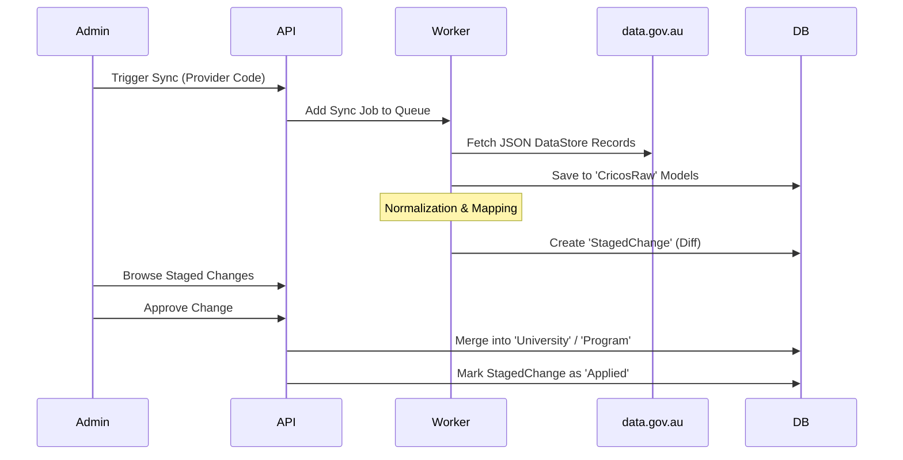

# Outvier System Overview

This document provides a comprehensive look at the technical architecture, data pipelines, and user workflows of the Outvier platform.

---

## 🏗️ 1. Architecture Flow

Outvier is architected as a high-performance, decoupled monorepo designed for scalability and data integrity.

```mermaid
graph TD
    subgraph "Client Layer"
        User[Student / Admin]
    end

    subgraph "Application Layer"
        Frontend[Next.js Frontend]
        API[Express API Service]
        Worker[Background Worker Service]
    end

    subgraph "Data & Messaging Layer"
        DB[(MongoDB)]
        Redis[(Redis / BullMQ)]
        Metabase[Metabase BI Engine]
    end

    subgraph "External Integration"
        CRICOS[data.gov.au CKAN API]
        AI[AI Providers: Groq/Mistral]
    end

    %% Interactions
    User <--> Frontend
    Frontend <--> API
    API <--> DB
    API <--> Redis
    Redis <--> Worker
    Worker <--> DB
    Worker <--> External Integration
    Metabase <--> DB
    API <--> Metabase
```

### Component Breakdown
- **Frontend**: A React-based Next.js application (App Router) using Radix UI and Vanilla CSS for a premium, accessible interface.
- **Express API**: The central nervous system, handling authentication (JWT/RBAC), data retrieval, and job orchestration.
- **Background Worker**: A dedicated process that consumes BullMQ tasks, performing long-running data syncs and AI enrichment without blocking the API.
- **MongoDB**: The primary document store, utilizing text indexes for fuzzy search and complex relationships for academic data.
- **Redis**: Powers the message queue (BullMQ) and provides caching for high-performance data access.
- **Metabase**: Provides deep business intelligence and analytics, embedded directly into the Admin dashboard.

---

## 🔄 2. Data Flow (CRICOS Pipeline)

The primary data source for Outvier is the official Australian Government CRICOS dataset. To ensure data integrity, Outvier uses a **Raw-Stage-Publish** pipeline.



---

## 🎓 3. Student Workflow

The student journey is designed to move from broad exploration to specific application management.

1.  **Exploration**:
    *   **Smart Search**: Use the landing page search to filter by state, field of study, or degree level.
    *   **Directory**: Browse comprehensive lists of Universities and Programs.
2.  **Personalization**:
    *   **Fit Score**: Set priority weights (e.g., Affordability vs. Global Ranking) to see a personalized match percentage for every program.
    *   **Scholarship Discovery**: Browse university-specific financial aid tailored to international students.
3.  **Decision Support**:
    *   **Comparison Matrix**: Select up to 4 programs for side-by-side analysis of fees, rankings, and career outcomes.
    *   **Sudokkho AI**: Consult the AI Copilot for advice on visa requirements, living costs, or program details.
4.  **Management**:
    *   **Kanban Tracker**: Add programs to the application tracker.
    *   **Checklist**: Manage document uploads (Passport, IELTS, Transcripts) and tasks for each application.

---

## 🛡️ 4. Admin Workflow

Administrators focus on maintaining the data integrity and platform health.

1.  **Data Ingestion**:
    *   **CRICOS Sync**: Enter a Provider Code to fetch official government records.
    *   **Raw Explorer**: Inspect raw JSON records for debugging or deep audits.
2.  **Quality Control**:
    *   **Staged Changes**: Review auto-generated diffs. Accept or reject changes to ensure only high-quality data reaches students.
    *   **Field Inspector**: Use schema tools to verify if government data structures have changed.
3.  **Content Enrichment**:
    *   **AI Tools**: Trigger AI jobs to find latest global rankings, graduate salaries, and scholarship details.
    *   **Manual Edits**: Fine-tune descriptions and marketing content for institutions.
4.  **Operational Monitoring**:
    *   **Health Dashboard**: Monitor sync job success rates and background worker performance.
    *   **Analytics**: Open the integrated Metabase dashboard to see platform usage trends and student preferences.

---

## 📋 5. Feature Matrix

| Feature | Student Role | Admin Role |
| :--- | :--- | :--- |
| **University / Program Directory** | Search & Filter | Ingest & Audit |
| **Fit Score Engine** | Personalize & View | Monitor Trends |
| **Application Tracker** | Manage Journey | View Aggregate Stats |
| **Scholarship Module** | Discover & Save | Manage & AI-Enrich |
| **Sudokkho AI** | Consult & Guide | Configure Providers |
| **Analytics (Metabase)** | N/A | Deep BI & Reporting |
| **Data Sync (CRICOS)** | N/A | Full Control |

---

## 🚦 6. Workflow Guides

### How to Sync a New Provider (Admin)
1.  Navigate to **Admin > CRICOS Sync > Provider Sync**.
2.  Enter the 6-digit **CRICOS Provider Code** (e.g., `00008C` for Monash).
3.  Click **Preview** to check record counts.
4.  Click **Sync Data**.
5.  Go to **Staged Changes** to approve the new records.

### How to Calculate Fit Score (Student)
1.  Log in and go to **Profile**.
2.  Adjust the **Priority Sliders** (e.g., set "Ranking" to 80% and "Cost" to 20%).
3.  Navigate to any Program page or the Directory.
4.  The **Fit Score** badge will automatically appear with your personalized match percentage.
