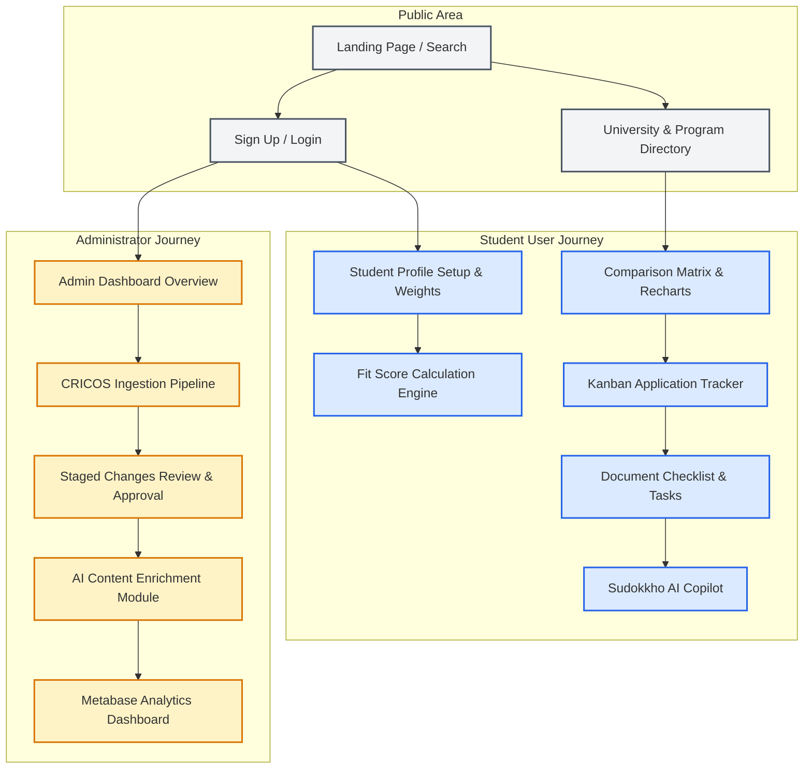
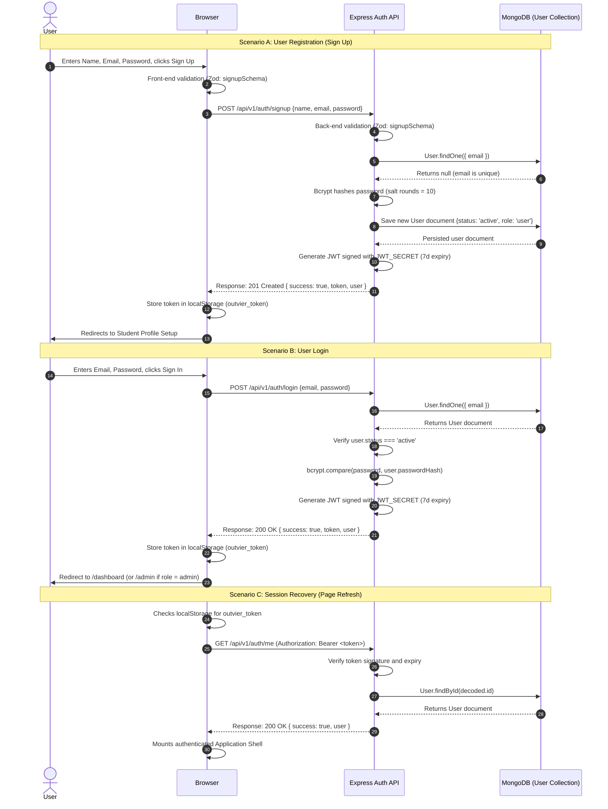
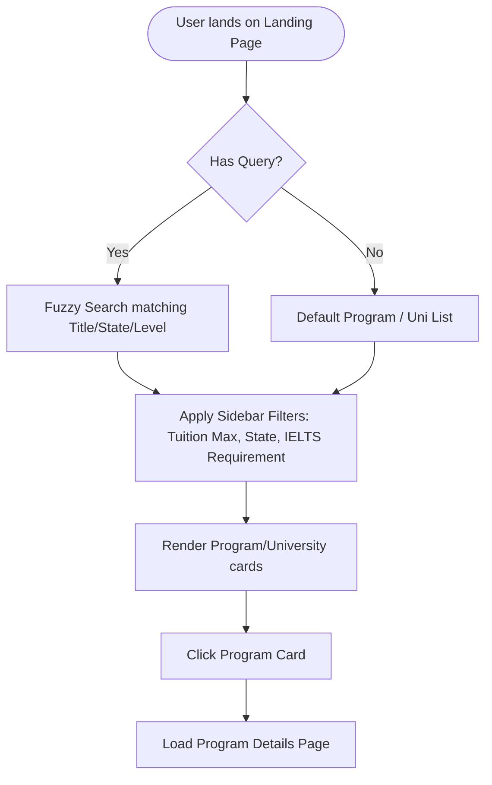
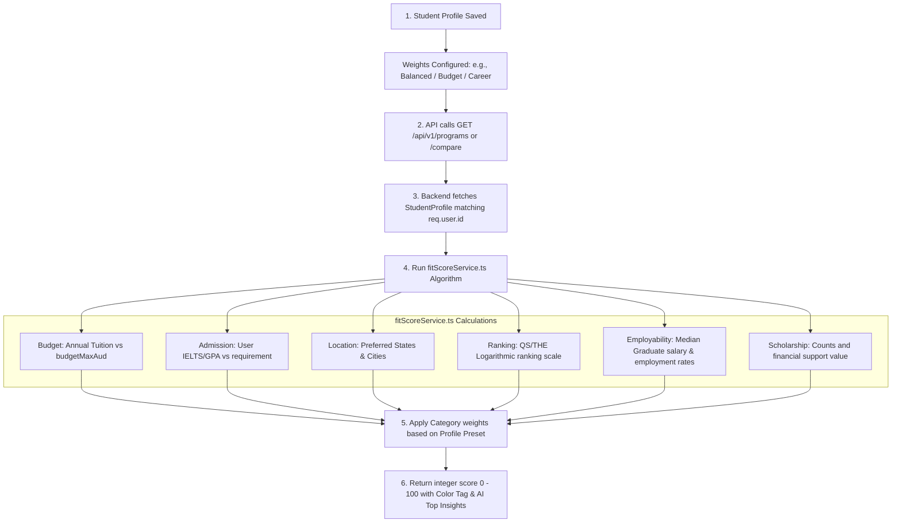
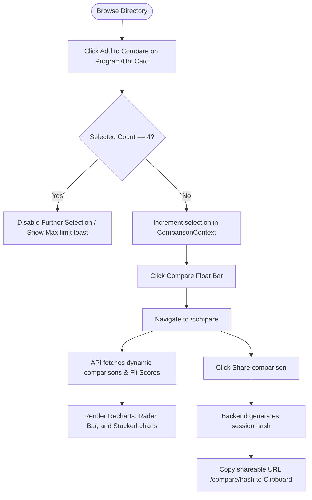
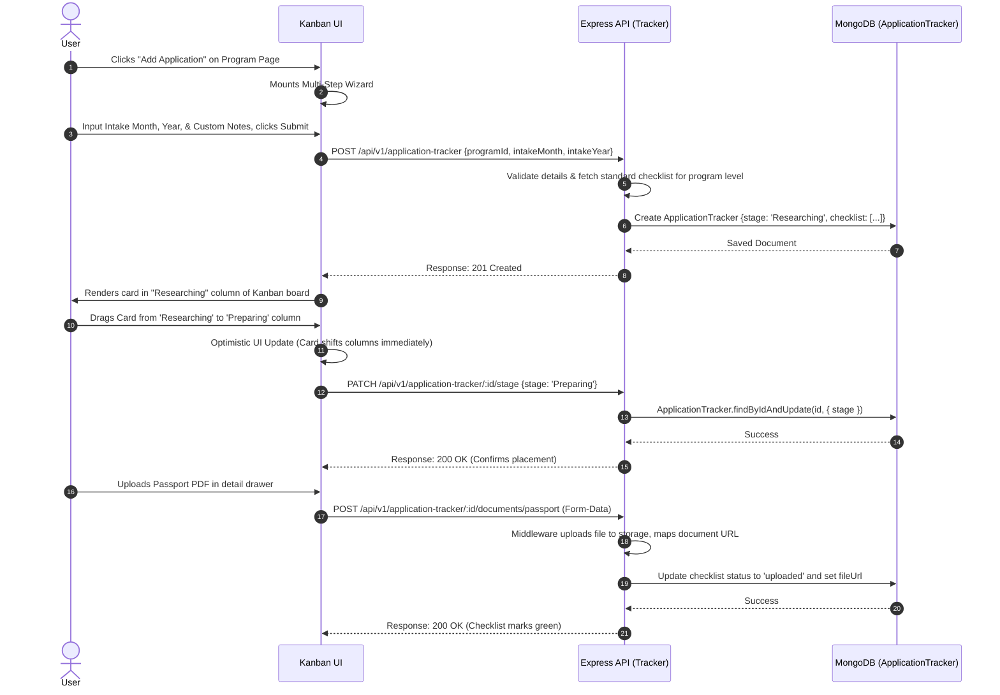
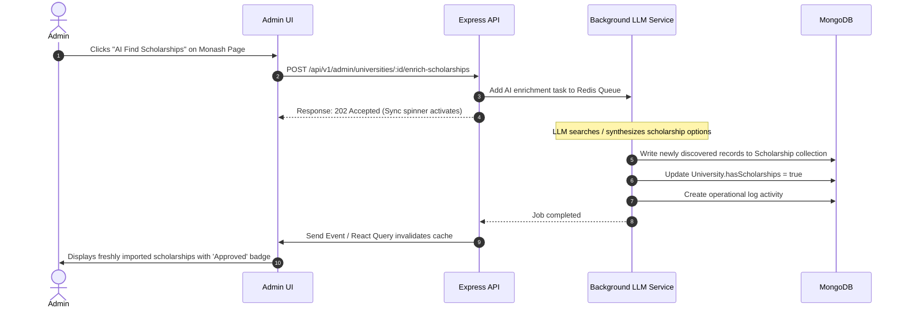
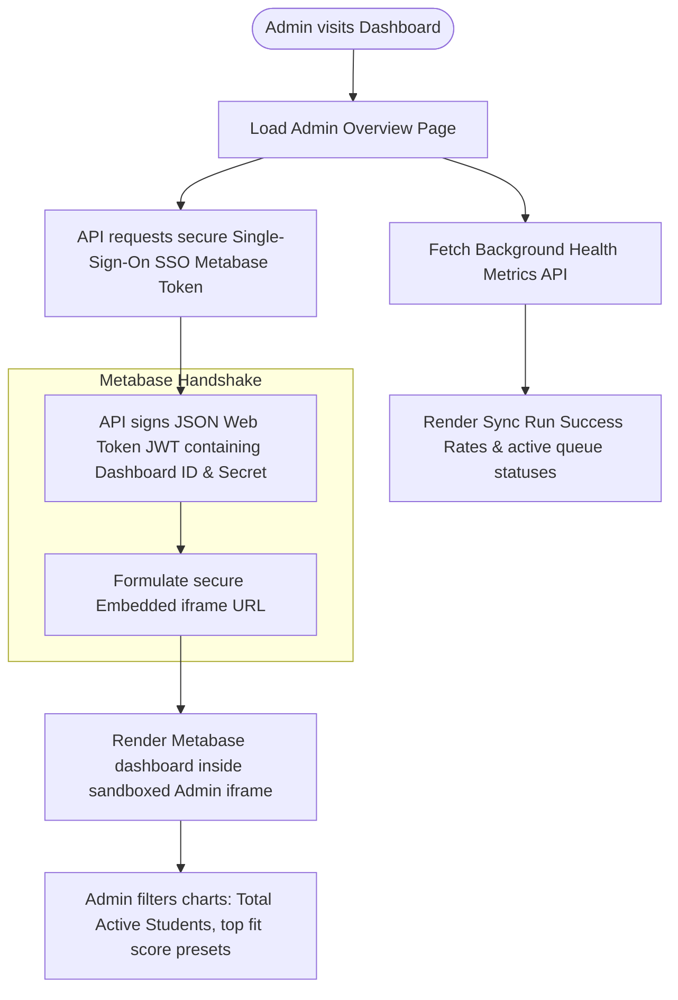

# Outvier — Comprehensive User Flow Documentation

This document provides a detailed mapping of the key user flows within the **Outvier** platform. It bridges frontend UI interactions, backend API endpoints, validation logic, background processing, and database mutations.

---

## 🗺️ Master Flow Map

The diagram below represents how different user journeys connect across the Student and Administrator environments.



---

## 🔑 1. User Sign Up, Login, and Session Recovery Flow

This flow details how users register an account, authenticate, remain logged in across page refreshes, and log out securely.

### A. Sequence Diagram



### B. User Actions & System State

| Phase | User Action | Frontend State | API / Backend Action | Database Mutation / Query |
| :--- | :--- | :--- | :--- | :--- |
| **Registration** | Fills in Sign Up form, clicks "Sign Up" | Validates input format; fires `authApi.signup()` mutation. | Validates payload, checks uniqueness of email, hashes password, saves record. | `INSERT INTO users` (Mongoose: `user.save()`) |
| **Authentication** | Fills in Login form, clicks "Sign In" | Dispatches `authApi.login()` mutation, disables inputs, triggers spinner. | Validates payload, searches user, matches bcrypt hash, signs JWT. | `SELECT FROM users WHERE email = ?` |
| **Persistence** | Reloads web page | Reads `outvier_token` from `localStorage`, displays app-wide global loading shell. | Decodes token via `protect` middleware, confirms user validity. | `SELECT FROM users WHERE _id = ?` (excluding `passwordHash`) |
| **Logout** | Clicks "Logout" in sidebar | Removes `outvier_token` from `localStorage`, redirects to `/login`. | Clear cookies (if used), returns success message. | None |

---

## 🎓 2. Student Exploration & Directory Flow

How students search, filter, and discover universities and programs without or before logging in.

### A. Flowchart



### B. User Actions & System State

*   **Step 1: Landing Page Search**
    *   *Action:* User types "Computer Science MASTER" into search bar and selects "Victoria" state.
    *   *Frontend:* Captures query variables and forwards user to `/programs?search=Computer+Science&level=master&state=VIC`.
    *   *API Endpoint:* `GET /api/v1/programs?search=...&level=...&state=...`
    *   *Database query:* Performs a MongoDB `$text` fuzzy query on `Program` fields, and filters by `level` and state.
*   **Step 2: Program Detail Exploration**
    *   *Action:* Student clicks "Master of Information Technology" at Monash University.
    *   *Frontend:* Navigates to `/programs/[id]` and initiates React Query fetching state.
    *   *API Endpoint:* `GET /api/v1/programs/:id` (Populates university details inside the program).
    *   *Database query:* `Program.findById(id).populate('university')` to load comprehensive details, tuition structures, and intakes.

---

## 📊 3. Fit Score & Personalization Flow

One of Outvier's premium core features: calculating a tailored program match score based on individual academic and budget parameters.

### A. Data & Calculation Flow



### B. User Actions & System State

*   **Step 1: Set Preferences**
    *   *Action:* User navigates to their profile page, adjusts the slider priorities (e.g., sets "Budget" weight to 45%, "Rankings" to 5%), and clicks "Save".
    *   *Frontend:* Sends a PUT request with the full parameters list to `/api/v1/student-profile`.
    *   *API Endpoint:* `PUT /api/v1/student-profile` (Uses `protect` middleware).
    *   *Database Mutation:* `StudentProfile.findOneAndUpdate({ userId: req.user.id }, req.body, { upsert: true })`
*   **Step 2: Real-time Calculation Display**
    *   *Action:* User navigates back to the Programs directory.
    *   *Frontend:* Every program card displays a dynamic badge (e.g. `92% Fit - Excellent Match` in a green tag).
    *   *API Endpoint:* `GET /api/v1/programs` (internally checks if the user is authenticated; if yes, fetches their `StudentProfile` and computes a Fit Score dynamically for each returned record).

---

## 📈 4. Multi-Item Comparison Matrix Flow

Allows students to compare up to 4 programs or universities side-by-side with rich visualization charts.

### A. Flowchart



### B. User Actions & System State

| Phase / Action | Frontend State | API Endpoint Invoked | Database Action / Query |
| :--- | :--- | :--- | :--- |
| **Selecting Items** | Tracks selected items (`[id1, id2]`) inside standard React Context. | None (Client-side state) | None |
| **Loading Comparison Matrix** | Mounts `/compare` page, passes array of IDs. Renders comparison matrices and inserts loading skeletons for Recharts. | `POST /api/v1/comparison/batch` | Queries multiple documents: `Program.find({ _id: { $in: ids } })` |
| **Fetching Fit Breakdown** | Renders dynamic metrics. Once scores load, overlays **Recharts RadarChart** showing the 6-axis overlays. | `GET /api/v1/comparison/scores?ids=...` | Sourced via `fitScoreService.ts` running algorithms against user's profile. |
| **Generating Shared Session** | Toggles sharing button state, copy-to-clipboard animation. | `POST /api/v1/comparison/sessions` | `INSERT INTO comparison_sessions` with generated unique hashes. |

---

## 📋 5. Kanban Application Tracker Flow

Tracks study applications through progressive pipeline phases with integrated tasks and document checkpoints.

### A. Sequence Diagram



### B. Kanban Board Columns & Life-Cycle Stages
Students guide their applications through six distinct visual pipeline stages:

1.  **Researching (default):** Initial bookmarking of programs. Standard document requirements generated.
2.  **Preparing:** Writing Statements of Purpose, seeking references, preparing certified transcript files.
3.  **Applied:** Formally submitted through university portals. Awaiting offer letter.
4.  **In Progress:** Handling conditional offers, submitting english test results, paying security deposits.
5.  **Onboarding:** COE (Confirmation of Enrolment) issued. Visa application lodged and health insurance finalized.
6.  **Archived:** Successfully completed applications or deferred/withdrawn programs.

---

## 🤖 6. Sudokkho AI (Copilot Advisor) Flow

Provides contextual conversational support to students searching for visa, housing, or degree details.

### A. Interaction Flow

```mermaid
graph TD
    User[Student types query: 'Is IELTS 6.5 enough for Monash Masters?'] --> Input[Sudokkho Panel captures Input]
    Input --> FetchContext[Frontend app gathers active Compare Program IDs]
    FetchContext --> API_Call[POST /api/v1/ai/chat {message, context: {profile, comparedPrograms}}]
    
    subgraph "Express Server - AI Orchestration"
        VerifyAuth[Validate User Session] --> BuildPrompt[Inject Context into System Instructions]
        BuildPrompt --> AppendHistory[Append conversation log memory]
        AppendHistory --> CallLLM[Invoke LLM Groq / Mistral Endpoint]
    end
    
    API_Call --> VerifyAuth
    CallLLM --> ReceiveResponse[Receive model response]
    ReceiveResponse --> DB_Log[Save message and response in ChatLog collection]
    ReceiveResponse --> SendClient[Send stream or message response to frontend]
    SendClient --> Display[Render rich markdown responses in conversation bubble]
```

---

## 🛡️ 7. Admin: CRICOS Data Sync Pipeline Flow

The primary data management pipeline used by administrators to ingest, verify, and publish official academic catalogs.

### A. Flowchart

```mermaid
graph TD
    Admin[Admin Logs in] --> Nav[Navigate to Admin / CRICOS Sync]
    Nav --> Input[Enter CRICOS Provider Code: e.g. 00008C]
    Input --> Action[Click Sync Data]
    Action --> API_Trigger[POST /api/v1/ingestion/sync {providerCode}]
    
    subgraph "Background Processing (BullMQ & Redis)"
        Queue[Push Job 'cricos-sync' into BullMQ] --> Worker[Worker takes Job]
        Worker --> API_Gov[Request data.gov.au CKAN API Resources]
        API_Gov --> DB_Raw[Write records to CricosRaw collections]
        DB_Raw --> Mapping[Run Mapper: durational normalizer & tuition mapper]
        Mapping --> DB_Stage[Calculate diff vs active collection & create StagedChange]
    end
    
    API_Trigger --> Queue
    DB_Stage --> Finish[Job completes: updates SyncRun status to SUCCESS]
    
    Finish --> Review[Admin views Staged Changes comparison UI]
    Review --> Choice{Approve Diff?}
    Choice -- Yes --> Apply[POST /api/v1/staged-changes/:id/approve]
    Apply --> Merge[Merge changes into University / Program / Location collection]
    Merge --> Active[Data is live for Students immediately]
    Choice -- No --> Reject[POST /api/v1/staged-changes/:id/reject]
    Reject --> Del[Mark StagedChange as Rejected / Delete Diff]
```

### B. Detailed Admin Action Sequence & Database Mutations

1.  **Triggering Sync Ingestion:**
    *   *Endpoint:* `POST /api/v1/ingestion/sync`
    *   *Payload:* `{ providerCode: "00008C" }`
    *   *Database:* Creates a `CricosSyncRun` record with status `'pending'`.
2.  **Staging Updates:**
    *   The background worker fetches institutions, courses, and course locations.
    *   *Database:* Writes raw data directly into `CricosInstitutionRaw`, `CricosCourseRaw`, and `CricosLocationRaw`.
    *   The mapper checks if this institution/course already exists in production.
    *   *Database:* If there's an update or new insertion, it creates a `StagedChange` document containing:
        *   `type`: `'create'` or `'update'`
        *   `targetCollection`: `'University'` or `'Program'`
        *   `diff`: A JSON object showing `{ field: { old: value, new: value } }`
        *   `status`: `'pending'`
3.  **Reviewing & Approving Changes:**
    *   Administrators view the color-coded side-by-side diff in `/admin/staged-changes`.
    *   *Endpoint:* `POST /api/v1/staged-changes/:id/approve`
    *   *Backend:* Reads the JSON diff. Merges values directly into the target active document.
    *   *Database Mutation:* Updates targeted `University` or `Program` record, and updates the `StagedChange` document status to `'applied'`.

---

## 🦾 8. Admin: AI Content Enrichment Flow

Outvier enhances basic Government CRICOS directories with AI enrichment to supply rich student-facing data.

### A. Sequence Diagram



---

## 📊 9. Admin: Operational Monitoring & Analytics (Metabase) Flow

Real-time business intelligence dashboarding for tracking platform usage and system diagnostics.

### A. Flowchart



### B. User Actions & System State

*   **Step 1: Dashboard Loading**
    *   *Action:* Administrator navigates to `/admin`.
    *   *Frontend:* Renders structural overview charts (Recharts) and loads a secure iframe element targeting `/admin/analytics`.
    *   *API Endpoint:* `GET /api/v1/analytics/dashboard-url` (using authentication checks).
    *   *Backend Action:* Utilizes the local Metabase secret key to sign a payload:
        ```javascript
        const payload = {
          resource: { dashboard: 1 },
          params: {},
          exp: Math.round(Date.now() / 1000) + (10 * 60) // 10 minute expiry
        };
        const token = jwt.sign(payload, METABASE_SECRET_KEY);
        const embedUrl = `${METABASE_SITE_URL}/embed/dashboard/${token}#bordered=true&titled=false`;
        ```
    *   *Database query:* None required for the token handshake; Metabase reads directly from the read-only replication or production database to render charts.
